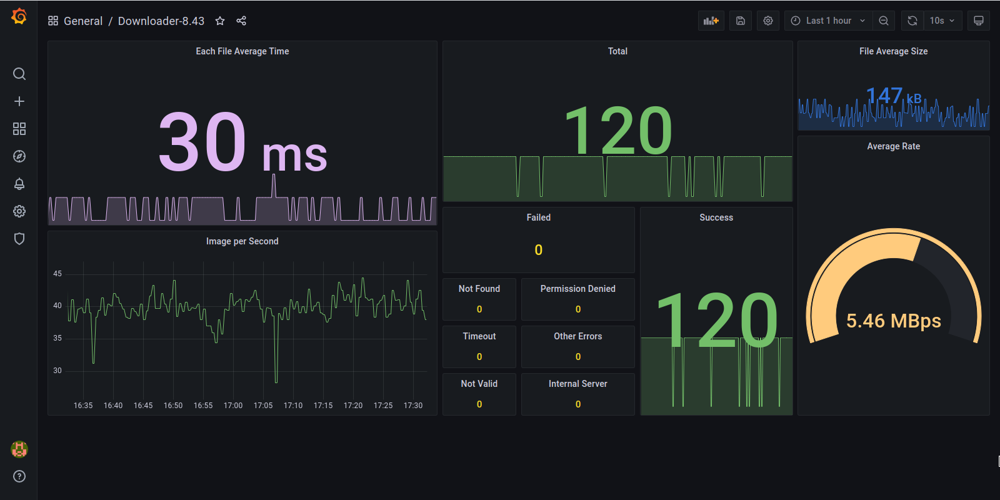

# Media Downloader
   
[](https://asciinema.org/a/v3uJFSjjkOsEIbJcuaechlvDN)
<a href="https://asciinema.org/a/v3uJFSjjkOsEIbJcuaechlvDN" target="_blank"></a>


## Description

A **Multi-Thread** Media downloader for small size files like image.

## Getting Started

### Dependencies

Dependencies are listed in `requirements.txt` file and automatically installed by `Docker`.

### Executing
Environment Variables can set/change in `docker-compose.yml`
```yaml
environment:
      DOWNLOADER_MODE: "VPN"
      DOWNLOADER_THREAD_NO: "40"
      REQUEST_TIMEOUT: "30"
      CONNECTION_ESTABLISHMENT_TIMEOUT: "1"
      DOWNLOADING_PATH: "media"
      DOWNLOADER_MAX_RETRY: "1"
```

run downloader by following command:

```sudo docker-compose up```

after successfully run this command logs should be like this:


`Prometheus Metrics` are accessible in `localhost:5000`

Metrics are:
1. `File_Average_Size`
1. `Total` count
1. `Faild` count
1. `Success` count
1. `Permissoin_Denied` errors count
1. `Not_Found` errors count
1. `Internal_Server` errors count
1. `Timeout` errors count   
1. `Not_Valid` errors count   
1. `File_Average_Time` count
1. `Average_Rate` of downloading files
1. `File_Per_Second` count


### Result
All downloaded file saved with a unique `uuid` in  `DOWNLOADING_PATH` folder specified name in environment variable in `docker-compose.yml`.

You can clone `prometheus` from [here](https://github.com/vegasbrianc/prometheus) and track live data reporting by 
`Gragana` panel running on `localhost:3000`

**Notice**: you should change `targets` in `prometheus/prometheus/prometheus.yml` to:
```yaml
scrape_configs:
  - job_name: my-service
    static_configs:
      - targets:
        - {YOUR-SYSTEM-IP-ADDRESS}:5000
```

**Grafana** panel should be something like this:



### Authors
Amir Rezaei [@ameerezae](https://github.com/ameerezae)
